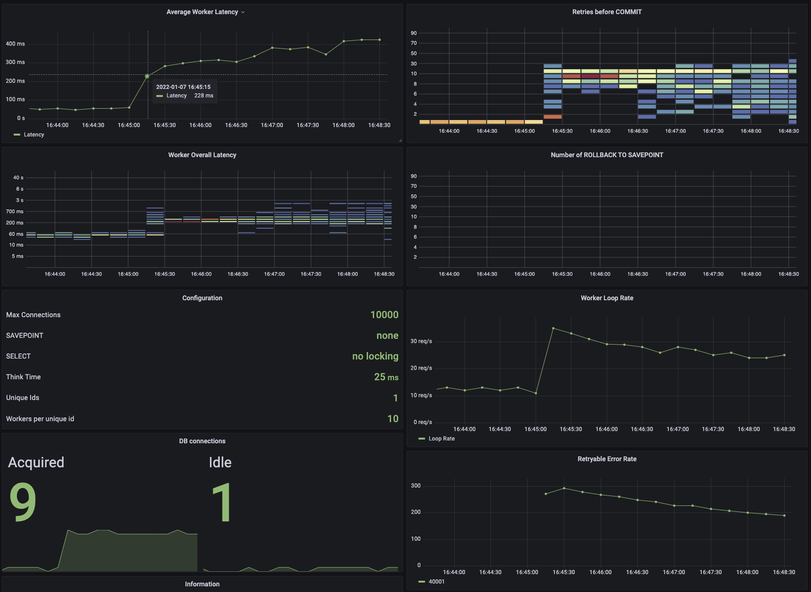
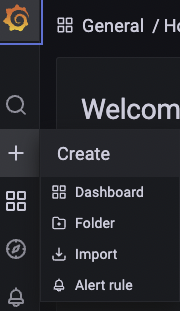

# Contender

A toy for demonstrating workload contention.

To install: `go install github.com/cockroachlabs/contender@latest`

## Workload

Contender use a simple key-value table to demonstrate the effects of contention in a CockroachDB
workload.

```
CREATE TABLE IF NOT EXISTS contend (
    id UUID NOT NULL PRIMARY KEY DEFAULT gen_random_uuid(),
    value INT NOT NULL DEFAULT 0
)
```

The `--uniqueIds` flag sets the number of unique ids to be chosen, and the `--workersPerId` flag
controls the number of concurrent workers for each id. Each worker executes the following SQL:

```
BEGIN;
SELECT value FROM contend WHERE id = $1 FOR UPDATE;
UPDATE contend SET value = $1 WHERE id = $2;
COMMIT;
```

## Graphs



The Contender workload is instrumented with metrics that will show the effects of contention:

* Per-worker timing histograms
* Number of retry-loops attempts necessary to commit the transaction
* Current configuration
* Worker throughput
* Number
  of [retryable error codes](https://www.cockroachlabs.com/docs/stable/transaction-retry-error-reference.html)
* DB connection pool

There is a [prometheus configuration](./assets/prometheus.yaml) to collect metrics. Once you have
[installed Prometheus](https://prometheus.io/docs/prometheus/latest/installation/), it will be as
simple as running `prometheus --config.file=prometheus.yaml`.

Finally, Install [Grafana](https://grafana.com/docs/grafana/latest/installation/) and import the [Grafana dashboard](./assets/dashboard.json) as shown here:

.

You will have to import the datasource for Prometheus and possibly refresh it from within each graph panel.

## Experiments to run

* Establish baseline of 1 id and 1 worker, with no think time.
* Increase to 10 ids, each with 1 worker.
* Increase to 2 workers per id. You might start seeing some contention.
* Increase to 10 ids with 10 workers each. This should definitely create contention.
* Enable `SELECT FOR UPDATE`. This will create explicit locking within CockroachDB which will cut
  down on the number of retries needed and will improve throughput.

## Flags

```
% contender --help
Usage of ./contender:
  -conn string
    	database connection string (default "postgresql://root@localhost:26257/defaultdb?sslmode=disable")
  -http string
    	a bind string for the metrics server (default ":8181")
  -maxConns int
    	the maximum number of open database connections (default 10000)
  -selectForUpdate
    	if true, use SELECT FOR UPDATE
  -thinkTime duration
    	the amount of time for workers to sleep during transaction (default 25ms)
  -tolerateErrors
    	set to true to ignore non-retryable errors
  -uniqueIds int
    	the number of unique keys to update (default 1)
  -workersPerId int
    	the number of workers trying to update each id (default 1)
```

* 
